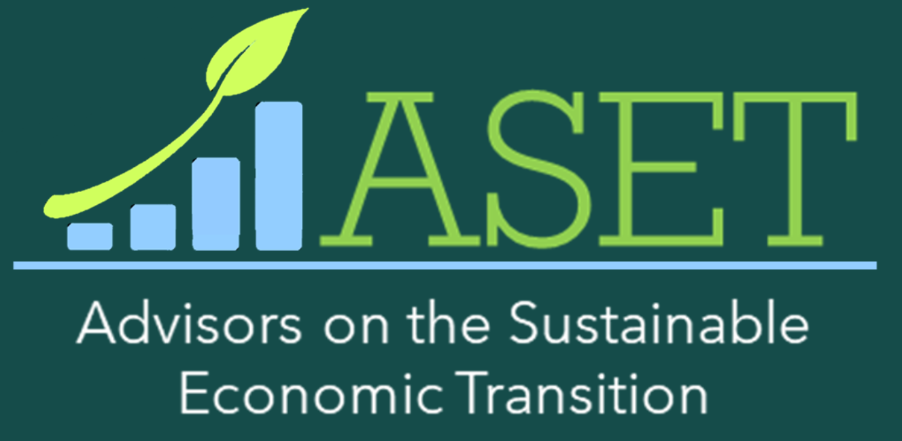
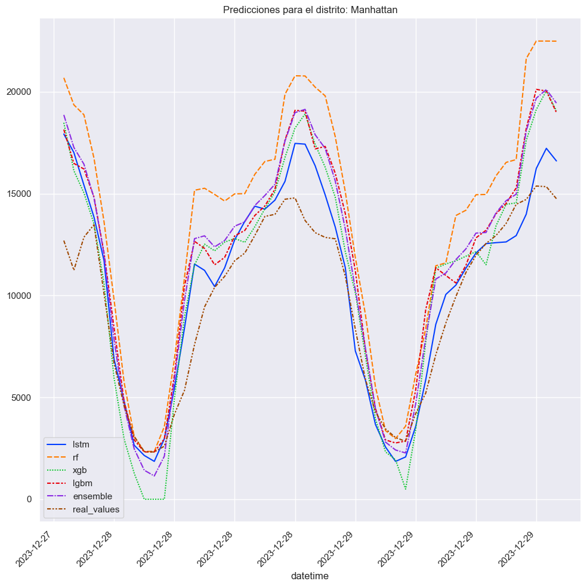
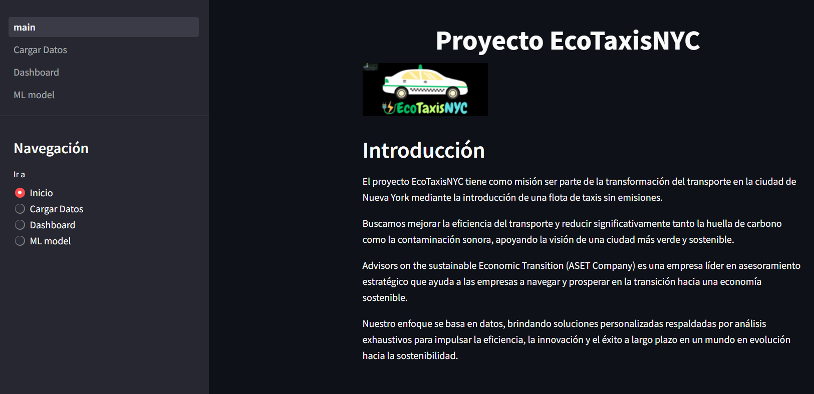
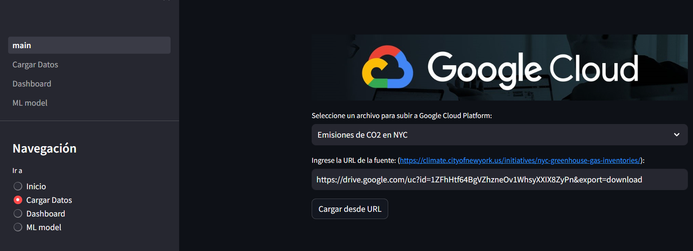
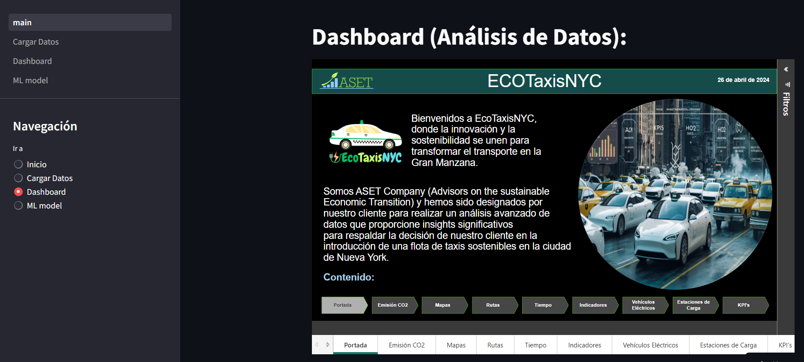
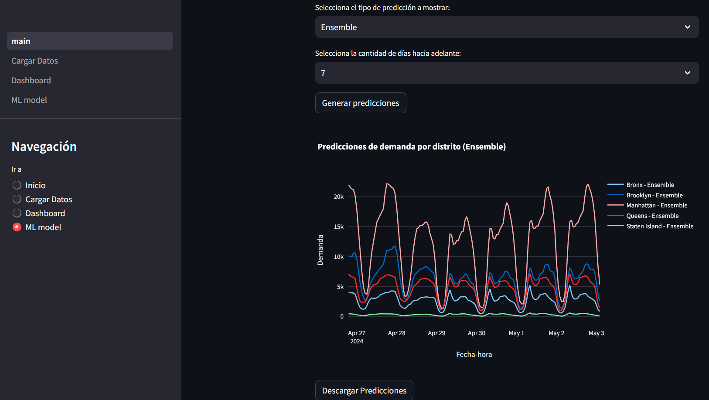

# EcoTaxisNYC
Data Science - PROYECTO GRUPAL

## Introducción
La ciudad de Nueva York, conocida por su constante actividad, enfrenta desafíos significativos en términos de contaminación ambiental, especialmente en lo que respecta a la calidad del aire y el ruido. A medida que sus casi 8,5 millones de personas se desplazan diariamente por las calles congestionadas de esta metrópolis, el impacto de las emisiones vehiculares y el ruido generado por el tráfico se ha convertido en una preocupación creciente tanto para los residentes, como para las autoridades gubernamentales y los defensores del medio ambiente por igual.  
La proliferación de vehículos convencionales, impulsados por combustibles fósiles, ha contribuido en gran medida a la contaminación del aire en Nueva York, con emisiones de gases nocivos que afectan la salud pública y degradan la calidad del entorno urbano. Además, el constante zumbido de motores y el estruendo de bocinas resuenan en las calles, añadiendo un nivel de ruido que afecta la calidad de vida de quienes viven y trabajan en la ciudad.  
Ante este panorama, surge una necesidad imperante de buscar soluciones innovadoras y sostenibles que mitiguen los impactos negativos del transporte urbano en el medio ambiente y la salud de la población. En este contexto, la introducción de una flota de taxis ecológicos emerge como una medida prometedora para abordar estos desafíos de manera integral. 
La transición hacia vehículos eléctricos y otros modelos de transporte sostenible no solo ofrece la oportunidad de reducir las emisiones de gases de efecto invernadero y mejorar la calidad del aire, sino que también puede contribuir significativamente a la disminución del ruido en las calles de la ciudad. Al adoptar tecnologías más limpias y eficientes, se abre la posibilidad de transformar el panorama del transporte en Nueva York, promoviendo un entorno más saludable y habitable para todos sus residentes. 
Advisors on the sustainable Economic Transition (ASET Company) es una empresa líder en asesoramiento estratégico que ayuda a las empresas a navegar y prosperar en la transición hacia una economía sostenible. Nuestro enfoque se basa en datos, brindando soluciones personalizadas respaldadas por análisis exhaustivos para impulsar la eficiencia, la innovación y el éxito a largo plazo en un mundo en evolución hacia la sostenibilidad. 
En este contexto, ASET Advisors on the Sustainable Economic Transition se embarca en un proyecto ambicioso y visionario, con el objetivo de proporcionar análisis avanzado de datos y soluciones basadas en machine learning que respalden la introducción exitosa de una flota de taxis sostenibles en la ciudad de Nueva York. A través de este esfuerzo colaborativo, buscamos no solo ayudar a nuestro cliente a mejorar la movilidad urbana, sino también contribuir a la construcción de un futuro más sostenible y próspero para las generaciones venideras. 

Staff: 
-	Rafael Balestrini – Data Engineer 
-	Carlos Macea – Data Engineer 
-	Luis Rojas – Data Analytics 
-	Alter Caimi – Machine Learning Engineer 

## Objetivos
Realizar un análisis avanzado de datos que proporcione insights significativos para respaldar la decisión de nuestro cliente en la introducción de una flota de taxis sostenibles en la ciudad de Nueva York. Este análisis abarcará una evaluación exhaustiva de diversos aspectos del mercado de transporte, incluyendo la demanda histórica y actual de servicios de taxis amarillos, taxis verdes y vehículos de alquiler de gran volumen. Además, se realizará un análisis geográfico para identificar áreas de alta demanda y oportunidades para una implementación eficiente de la flota sostenible.  
Además, nuestro proyecto incluirá el desarrollo de un modelo de machine learning que prediga la demanda de pasajeros en el corto plazo y/o en tiempo real. Este modelo utilizará datos históricos de viajes y factores climáticos, para identificar los lugares donde la flota de taxis sostenibles puede competir con mayor probabilidad de éxito.  
En resumen, nuestro objetivo es proporcionar a nuestro cliente una comprensión profunda y basada en datos del mercado de transporte en Nueva York, junto con herramientas predictivas que les permitan tomar decisiones estratégicas informadas sobre la introducción de una flota de taxis sostenibles. 

## Alcance

1.	Análisis Profundo de Datos de Servicios de Taxis (Estado de Mercado): 
Realizar un análisis detallado de la demanda de servicios de taxis amarillos, taxis verdes y vehículos de alquiler de gran volumen a lo largo del tiempo, identificando patrones estacionales, diarios y por hora. 
Explorar la distribución geográfica de los servicios de taxis para identificar áreas de alta demanda y oportunidades para la implementación eficiente de una flota de taxis sostenibles. 
Analizar la duración de los viajes, los puntos de inicio y finalización más comunes, así como los posibles cuellos de botella en la red de transporte. 
Revisar los costos asociados a las tarifas por cada viaje. 
2.	 Evaluación del Impacto Ambiental de la Flota de Taxis Sostenibles:  
Utilizar los datos disponibles sobre los diferentes tipos de vehículos y su eficiencia, así como los datos sobre la calidad del aire y el ruido, para evaluar el impacto potencial de una flota de taxis sostenibles en la reducción de emisiones y la mejora de la calidad ambiental. Esta evaluación se realizará por Distrito 
3.	 Evaluación de la Viabilidad de la Flota de Taxis Sostenibles:  
Realizar un análisis comparativo de condiciones técnicas y costos entre los diferentes tipos de vehículos (eléctricos) para determinar los posibles tipos de vehículos que se deberían considerar en el momento de la compra de vehículos para la flota. 
Identificar las tarifas promedio de servicio, impuestos, peajes, propinas, etc. Para estimar el costo del servicio.
4.	 Desarrollo de KPIs y Dashboard Personalizado:  
Identificar y definir KPIs específicos que sean relevantes para medir el éxito de la introducción de una flota de taxis sostenibles, como la reducción de emisiones y la eficiencia del servicio. (mínimo 3 KPI’s). 
Diseñar un dashboard personalizado que visualice estos KPIs así como también muestre el análisis de mercado, impacto ambiental y viabilidad de la introducción de la flota de taxis sostenibles. Para soportar la toma de decisiones informadas. 
5.	Modelo Predictivo:  
Desarrollar modelo predictivo utilizando técnicas de machine learning para prever la demanda futura de servicios de taxis y optimizar la asignación de recursos (flota de taxis sostenibles) en función de la demanda prevista y otros factores externos como el clima y eventos especiales. 
6.	 Despliegue en la Nube y en la Web:  
Trasladar todos los componentes del proyecto, incluidos los datos, el código, el dashboard interactivo y el modelo de machine learning, a una plataforma en la nube para su ejecución y acceso remoto. Lo que garantiza automatización, escalabilidad y disponibilidad.
Fuera de Alcance: 
Análisis Económico de la Incorporación de Vehículos Alternativos vs Convencionales: No es necesario, no se considera como opción la incorporación mixta o completa de vehículos convencionales, dado que el propósito del cliente es el impacto positivo en la reducción de emisión del CO2 en NYC. Además, el gobierno local tiene planes a corto, mediano y largo plazo para la sustitución de vehículos convencionales a eléctricos. 
Análisis de la contaminación del aire o ruido por zonas: No se cuenta con información suficiente para esta discriminación en la información; aunque se hará lo posible “de ser necesario”, realizar estimaciones basadas en los tipos de vehículos que transitan por zona. Sin embargo, se considera que la agregación actual es suficiente para conocer el impacto de los vehículos en la contaminación ambiental.
Vehículos convencionales de alquiler: Este servicio no es representativo al ser de servicios especiales por lo general de lujo que al no incluirlo en el análisis, no genera impacto en el negocio particular del cliente. 

## Tecnologías clave para el análisis de datos de taxis en Nueva York

Para abordar este proyecto, se implementó una estrategia basada en la recopilación, procesamiento y análisis de datos de diversas fuentes. Las tecnologías utilizadas en este proyecto demuestran el poder de la analítica de datos para abordar problemas complejos y tomar decisiones estratégicas. La combinación de herramientas como Cloud Platform, Python, Pandas, TensorFlow, Matplotlib, Seaborn, Streamlit y Power BI permite un análisis de datos completo y eficiente, desde la recolección y procesamiento hasta la visualización y presentación de resultados, lo que conduce a la toma de decisiones estratégicas informadas:
1.	Recopilación y almacenamiento de datos:
    -	Técnicas de extracción de datos: Se emplearon diversas técnicas para obtener los datos necesarios, incluyendo:
        -	Web scraping: Se extrajeron datos del sitio web [Electric Vehicle Database]([Documentación/Documentación_Sprint_1.pdf](https://ev-database.org/)) relevante para obtener información actualizada sobre los vehículos electricos.
        -	Descarga de archivos: Se descargaron archivos en formato .parquet y .csv de fuentes oficiales y públicas.
    -	Infraestructura en la nube: Google Cloud Platform (GCP) se utilizó como plataforma central para el almacenamiento y procesamiento de datos proporcionando una base sólida para el manejo de grandes volúmenes de datos.
        -	Cloud Storage: Se emplearon buckets de Cloud Storage para almacenar los datos recopilados de diferentes fuentes.
        -	BigQuery: Se utilizó BigQuery como almacén de datos (Data Warehouse) para almacenar y consultar los datos de forma eficiente.

2.	Procesamiento y análisis de datos:
    -  Python: El lenguaje de programación principal utilizado para el desarrollo de scripts, análisis de datos y creación de modelos de machine learning.
        -  Beautiful Soup: Biblioteca para extraer datos de sitios web mediante web scraping.
        -  Pandas: Biblioteca para manipulación y análisis de datos, incluyendo limpieza, transformación y visualización.
        -  TensorFlow: Biblioteca para el desarrollo y entrenamiento de modelos de machine learning y construcción de modelos de aprendizaje profundo personalizados para tareas que requieren un alto grado de control y flexibilidad.
	  -  [Cloud Functions](Google_Cloud_Platform/cloud_functions/): Se utilizaron Cloud Functions para automatizar tareas de procesamiento de datos, como la limpieza y transformación de los mismos para luego ser cargados en BigQuery (ETL).
    -  Cloud Scheduler: Se programaron tareas de extracción y procesamiento de datos de forma periódica utilizando Cloud Scheduler.
    -  [Análisis de datos](EDA/): Se analizaron las relaciones entre variables como el número de viajes, la calidad del aire, la contaminación sonora y las condiciones climáticas para identificar patrones y tendencias.
    -  [Preprocesamiento](EDA/): Se limpiaron y transformaron los datos utilizando Pandas, eliminando duplicados, valores nulos y inconsistencias. 
4.	Visualización y presentación de resultados:
    -  [Streamlit](Streamlit/): Se desarrolló una aplicación web con Streamlit para visualizar los resultados del análisis de datos y el modelo de machine learning.
    -  Power BI: Se creó un [dashboard](Dashboard/) en Power BI para mostrar los indicadores clave de rendimiento (KPIs) y las principales conclusiones del análisis.
  
## Modelo de Machine Learning

Se desarrolló, entrenó y desplegó en línea un modelo de Machine Learning para predicción de demanda a nivel franja horaria y distrito en la ciudad de Nueva York. 
El modelo es de tipo Weighted Ensemble en el cual se combinan las predicciones de: 
- Red Neuronal Recurrente de tipo LSTM, con dos capas LSTM de 100 y 60 unidades cada una. Una capa de salida Dense de 5 unidades permite que la red neuronal prediga los valores de demanda en cada distrito de la ciudad.
- Random Forest: cada distrito de NYC tiene su modelo de Random Forest con hiperparámetros optimizados para la demanda de ese distrito.
- XGBoost: cada distrito de NYC tiene su modelo de XGBoost con hiperparámetros optimizados para la demanda de ese distrito.
- LightGBM: cada distrito de NYC tiene su modelo de LightGBM con hiperparámetros optimizados para la demanda de ese distrito.
El ensemble combina las predicciones de los cuatro modelos en una única salida. La combinación es en base a un promedio ponderado de las predicciones de cada modelo, teniendo en cuenta el error RMSE de cada uno en cada distrito.  
El ensemble es entrenado con 2 años de datos, y selecciona automáticamente la ponderación más efectiva. 
A continuación podemos ver la comparación de diferentes predicciones:  
  
En Streamlit se a desarrollado una aplicación que permite cargar datos en la nube, utilizar el dashboard interactivo en tiempo real y realizar predicciones de demanda:  
  
  
  
  

## Consideraciones adicionales

Es importante destacar que este análisis se basa en un conjunto de datos limitado y que se requieren estudios más profundos para comprender en detalle la relación entre los viajes en taxi, la calidad del aire y la contaminación sonora. Se recomienda continuar recopilando y analizando datos para mejorar la precisión de los modelos y obtener una visión más completa del impacto del transporte en el medio ambiente.

Más detalles en la [documentación de sprint1](Documentación/Documentación_Sprint_1.pdf)

